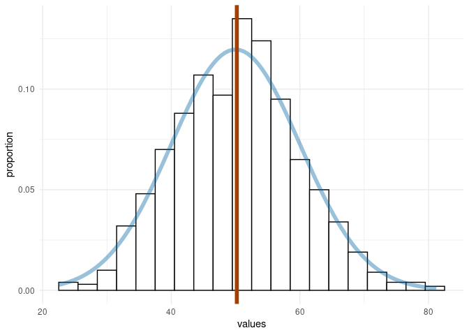
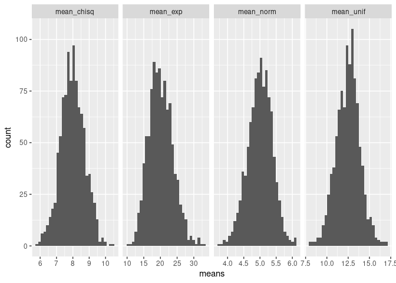
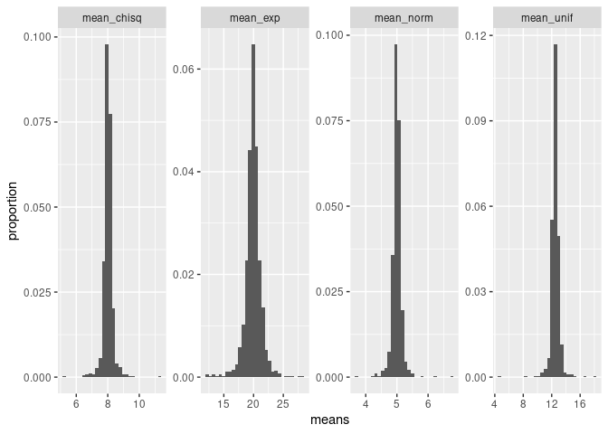

Activity 11 - Simulation
================
Bruce Buurstra

## The Central Limit Theorem

From your introductory statistics course, recall that the **Central
Limit Theorem** tells us about the distribution of a sample mean, which
is called the sampling distribution. As sample size becomes sufficiently
large, the sampling distribution approaches a normal distribution and
the standard deviation of the sampling distribution decreases.

In this activity, we will explore these findings with a statistical
simulations. **For this activity, we will use a seed of 518.**

Note that when you knit your report, your results will always be the
same; however, if you re-run code chunks individually, they use
different seeds. One way to make sure that you get similar results each
time is to always run all previous code chunks  before running the current code
chunk .

## Set-up

For this activity, you will need the `{tidyverse}`.

**delete this line and load `{tidyverse}`**

``` r
library(tidyverse)
```

    ## ── Attaching packages ─────────────────────────────────────── tidyverse 1.3.1 ──

    ## ✓ ggplot2 3.3.4     ✓ purrr   0.3.4
    ## ✓ tibble  3.1.2     ✓ dplyr   1.0.7
    ## ✓ tidyr   1.1.3     ✓ stringr 1.4.0
    ## ✓ readr   1.4.0     ✓ forcats 0.5.1

    ## ── Conflicts ────────────────────────────────────────── tidyverse_conflicts() ──
    ## x dplyr::filter() masks stats::filter()
    ## x dplyr::lag()    masks stats::lag()

## Exploration

### Normally distributed population

Below I generate 1,000 samples from a Normally distributed random
variable with a mean 50 and standard deviation 10 and constructed a
*histogram* and overlay a line for the distribution.

``` r
norm_samp_1000 <- tibble(
  values = rnorm(n = 1000, mean = 50, sd = 10)
)

ggplot(norm_samp_1000, aes(x = values)) + 
  geom_histogram(aes(y = ..count.. / sum(..count..)),       # plot proportion instead of count
                 fill = "white",
                 color = "black",
                 binwidth = 3) +                            # specify how big bins should be
  stat_function(fun = function(x)                           # some rescaling "magic" to get correct densities
                      dnorm(x, mean = 50, sd = 10) * 3,     # see: https://stackoverflow.com/a/36344354
                color = "#0065a4",                          # laker-blue is #0065a4
                size = 2,                                   # make line a little thicker
                alpha = 0.4) +                                
  geom_vline(xintercept = mean(norm_samp_1000$values),      # plot vline at mean of sample
             color = "#a43f00",                             # pick a color to contrast blue
             size = 2) +
  theme_minimal() +                                         # get ride of chart junk
  labs(y = "proportion")                                    # rename y axis
```

<!-- -->

Using `norm_samp_1000`, obtain the mean and standard deviation of this
sample?

``` r
(norm_samp_1000 %>%
  summarise(mean = mean(values), sd = sd(values)))
```

    ## # A tibble: 1 x 2
    ##    mean    sd
    ##   <dbl> <dbl>
    ## 1  50.2  9.59

Now, create a new simulation. In this you will obtain a sample of size
30 from from a Normally distributed variable with a mean 50 and standard
deviation 10, and find the mean and standard deviation. How do the mean
and standard deviation compare to your answers above?

They are very similar but slightly off.

``` r
norm_samp_30 <- tibble(
  values = rnorm(n = 30, mean = 50, sd = 10)
)

(norm_samp_30 %>%
  summarise(mean = mean(values), sd = sd(values)))
```

    ## # A tibble: 1 x 2
    ##    mean    sd
    ##   <dbl> <dbl>
    ## 1  47.8  9.87

### Non-normally distributed population

Using a similar process, obtain Exponentially distributed variable
(`?rexp`) with a *rate* of 0.02. Obtain a sample of 1,000 observations
and a sample of 30 observations. Then, calculate the mean and standard
deviation of each sample and discuss how the values are similar and how
they differ.

The means are very similar but the sd’s are a bit different.

``` r
exp_samp_1000 <- tibble(
  values = rexp(1000, 0.02))

exp_samp_30 <- tibble(
  values = rexp(30, 0.02))

(exp_samp_1000 %>%
  summarise(mean = mean(values), sd = sd(values)))
```

    ## # A tibble: 1 x 2
    ##    mean    sd
    ##   <dbl> <dbl>
    ## 1  48.3  49.6

``` r
(exp_samp_30 %>%
  summarise(mean = mean(values), sd = sd(values)))
```

    ## # A tibble: 1 x 2
    ##    mean    sd
    ##   <dbl> <dbl>
    ## 1  36.5  34.9

 **Planned Pause Point**: If you have any
questions, contact your instructor. Otherwise feel free to continue on.

## Many distributions

We previously looked at one distribution at a time. It would be nice to
explore multiple distributions simulataneouly. To do this, we will
create a new function. Yay!

Write a function (say, `generate_n_samples`) that takes `n` (how many
values to sample) as its argument. This function should produce a
dataset containing four columns: one that generates data from a
**Normal** distribution (parameters mean and standard deviation), one
from a **Exponential** distribution (parameter rate), one from a
**Chi-square**
distribution`(parameter degrees of freedom), and one from a **Uniform** distribution (parameters minimum and maximum). This function should produce a dataset with`n\`
rows.

You should **not** use the default parameter options for these
distributions (e.g., your Normal data should not have a mean of 0 or a
standard deviation of 1). Test your function with `n = 30` and
`n = 1000`.

``` r
generate_n_samples <- function(n){
  norm <- rnorm(n, mean = 5, sd = 2)
  exp <- rexp(n, rate = 0.05)
  chisq <- rchisq(n, df = 8)
  unif <- runif(n, min = 0, max = 25)
  data <- data.frame(cbind(norm, exp, chisq, unif))
  return(data)
}

generate_n_samples(30)
```

    ##        norm        exp     chisq       unif
    ## 1  3.981814  0.4784219 10.045213 21.5127501
    ## 2  6.201528 13.1343045  3.225027 22.2888424
    ## 3  7.472693 42.9879200  7.043137 14.3835115
    ## 4  6.505935  9.2758189 12.355461 19.7442271
    ## 5  6.847187  8.8682978  8.374953 13.6461224
    ## 6  8.415142 63.2315873  6.657426 19.3532030
    ## 7  7.316817 22.9297510  6.916638  7.9855142
    ## 8  5.708101  4.6727466 12.395002 23.4726710
    ## 9  5.644209  5.7468560 10.073711  0.3795234
    ## 10 5.247094 59.6207713  3.243300 19.6394676
    ## 11 7.554472 40.4355675 10.869143  4.4073410
    ## 12 4.264633  5.9806021  8.220676  0.5940352
    ## 13 3.131512  9.5618904  7.669959 21.9791167
    ## 14 8.117507  2.7175246  4.276777 18.7110002
    ## 15 4.343127 23.8368010 15.568719 21.2826624
    ## 16 5.568328  8.6372278  7.785592 17.2309147
    ## 17 4.787828  1.1339243  8.380036 10.6361539
    ## 18 3.855243 15.9163908  8.077745  1.8011637
    ## 19 1.111971  7.8963547 12.085672 12.6221378
    ## 20 9.006491 14.6060967  8.762560 10.5812764
    ## 21 1.695564  5.8169414 11.240253  8.2199093
    ## 22 3.838645 40.2977936  6.012287 24.3983235
    ## 23 3.359409 36.5151274 11.401034 16.5373255
    ## 24 4.190095  6.8453109 10.455212 16.9161717
    ## 25 6.024422 15.8707006  8.696357  9.7062607
    ## 26 3.900876 21.4762424 10.061784 24.1740929
    ## 27 3.816381 30.9246671 11.049296  3.9091750
    ## 28 2.241042 47.4503438  4.485057  2.9711695
    ## 29 4.546295 47.7666982  8.114986 18.2536634
    ## 30 3.641512 23.5438403  5.779365  9.7572027

``` r
generate_n_samples(1000)
```

    ##            norm          exp      chisq        unif
    ## 1     4.3701835 4.069972e+01 10.3420598 15.42030918
    ## 2     6.2682009 3.858611e+00 11.7866476 24.96228872
    ## 3     3.4422813 2.191271e+01  5.2460303 18.27094976
    ## 4     5.8843002 2.624476e+01 10.4574842  9.64471071
    ## 5     6.8628972 1.681138e+01  8.4184108 19.65452053
    ## 6     6.0519272 5.172122e+01  6.7608359  3.43231715
    ## 7     5.1932067 2.166229e+00  6.1948470 16.08296054
    ## 8     3.5442328 1.758064e+01 14.5825966 12.51847240
    ## 9     4.1354744 2.200337e-01  8.9016594  1.48762643
    ## 10    4.7190032 2.726498e+01 11.5913339  1.44135923
    ## 11    6.7569865 4.606788e+01 10.8416770  2.25568366
    ## 12    4.0192873 5.184656e+01  7.8954846  0.05690604
    ## 13    2.9543850 5.817091e-01 14.1742557 10.67318100
    ## 14    8.4316345 1.059553e+01  4.5993783 16.85735538
    ## 15    6.5590519 4.482745e+01  6.6351389  9.61487624
    ## 16    1.8482852 3.524150e+01  2.2741669 14.58463348
    ## 17    5.7736559 8.016794e+00 17.3359099 11.04653222
    ## 18    6.4003908 8.578826e+00 10.7466428  0.22052624
    ## 19    4.5170151 5.771086e+01  5.4249836  4.02193289
    ## 20    4.9544370 7.064576e+00  7.2498222 16.75509270
    ## 21    4.9445803 3.870721e+01  3.6068115  7.48080320
    ## 22    6.1242683 5.709136e+01  7.4932287 16.63973684
    ## 23    9.1955663 2.125987e+01  4.3637925 10.97309617
    ## 24    1.7240816 3.728055e+01  3.9567954 16.86369364
    ## 25    5.5716639 5.311668e+00  4.4171214 22.51725077
    ## 26    3.8973110 9.349111e+00  4.3958864 19.74780285
    ## 27    4.3398314 1.325812e+01  4.0768139 18.05903947
    ## 28    6.0880060 8.226641e-01  9.4461337  9.01338357
    ## 29    5.6519617 2.926798e+01 17.2898944 17.78812236
    ## 30    2.0751927 5.145163e+00  8.7332550 13.45300116
    ## 31    8.5629548 6.871974e+00  6.5142246  7.68839171
    ## 32    3.0288433 5.697168e+00  1.7769633 21.64370993
    ## 33    4.3552241 2.158107e+01 10.3523360 18.92890480
    ## 34    7.8754072 2.180586e+01  3.9598238  4.51498428
    ## 35    4.2933298 1.631180e+01  8.0496966  5.40332219
    ## 36    3.4199443 4.167577e+00  9.6389951  6.70001152
    ## 37    6.8824187 3.424226e+01  8.8456911 13.90736313
    ## 38    4.2874806 5.210068e+01  3.5970054 23.80575248
    ## 39    6.6834002 2.775889e-01 11.2846289 12.86350754
    ## 40    6.7420609 1.071260e+01  6.6631937 20.88688777
    ## 41    2.4425122 1.976999e+01  7.4959033 13.25399998
    ## 42    2.7215898 7.676013e+00  6.0835167 21.33987513
    ## 43    6.8152589 2.089498e+01 12.5101561  8.93539941
    ## 44    2.7733456 1.404712e+01  6.0902326 19.23176520
    ## 45    2.3416129 6.171569e+00 11.7801660 10.56552263
    ## 46    5.8022559 1.261003e+01  9.5525512 16.43673386
    ## 47    4.8964304 1.722861e+01  9.4697125  8.54168608
    ## 48    6.8953030 9.349822e+01  9.5921385 20.03885090
    ## 49    3.0607702 5.876822e+00  7.8155662 14.50970581
    ## 50    4.2335296 1.107057e+00 11.9489896 14.06118989
    ## 51    3.3234270 6.997003e-01  8.3521532  7.30313475
    ## 52    9.3120772 3.304411e+01 10.5568229 16.61769112
    ## 53    4.6892997 1.412560e+00  2.7832752 12.32193333
    ## 54    0.8314804 9.917576e-01  8.8324760  1.98092071
    ## 55    6.6772464 1.056882e+02  2.6057131 17.79191899
    ## 56    7.1497116 5.168418e+01 11.0870211  2.65514463
    ## 57    4.0744850 2.369901e+01  9.0496560 23.00433780
    ## 58    4.8582057 2.656547e+01  3.6855448 10.65837884
    ## 59    3.9547802 3.232168e+01  7.5811413 18.33047376
    ## 60    0.8187755 5.759253e+00  8.9973180 10.34093222
    ## 61    1.8253120 4.657070e+01 10.9111732 10.16521433
    ## 62    4.4287139 3.539558e+01 13.5502587  7.34746206
    ## 63    4.1193679 4.496895e+01 10.1798476 17.06580718
    ## 64    3.6652969 1.726632e+01  5.2122585 20.49840650
    ## 65    6.3068457 6.221703e+01  4.7286714  0.11774147
    ## 66    9.2984637 3.283290e+01  8.6077115 10.61387358
    ## 67    2.2357130 1.006594e+02  4.0454284 13.25615749
    ## 68    5.5093245 6.244562e+01  4.3718768 22.77195873
    ## 69    4.2673429 3.065683e+01  8.6469741 23.54513283
    ## 70    3.4852146 7.487340e+00  6.6664668  4.39189000
    ## 71    1.6820766 1.704548e+00  1.6168544  2.70481893
    ## 72    4.6307808 1.734523e+01 10.8262045 13.02112825
    ## 73    1.4846284 1.300245e+01  2.9273819 14.64886708
    ## 74    5.2296094 5.923344e+01  5.0858678  2.48767110
    ## 75    6.3445576 1.096210e+01 13.6734750  8.09067718
    ## 76    4.6613220 1.368059e+01  2.3266718  7.09161511
    ## 77    4.8015497 2.650391e+01 10.4842786  5.31516278
    ## 78    6.9149646 1.792971e+01  7.3113668  8.29158194
    ## 79    5.6007436 2.659101e+01  9.6795177 10.83235902
    ## 80    2.2551415 4.624631e+01  9.7420417 17.90570276
    ## 81    6.6919795 6.019589e+01  8.2116962 14.74771606
    ## 82    4.8837500 2.070472e+00  7.9985235 11.95542931
    ## 83    3.7442137 2.781905e+01  4.5763688  3.61192385
    ## 84    7.3634462 3.754728e-01  1.8829240  6.82092342
    ## 85    8.6729164 1.273223e+00  5.2319306 19.16478937
    ## 86    6.0402474 1.819062e+01  6.6342729 24.70402732
    ## 87    5.0839230 1.656768e+01 10.4439826  8.72869932
    ## 88    6.2410305 1.081255e+00  1.9844435 21.49223434
    ## 89    5.0245086 5.536228e+00  8.8269205  8.94364736
    ## 90    5.3116191 5.882376e+01 11.7376160 14.63878437
    ## 91    6.8089959 6.355088e+00 14.3110538 18.40094213
    ## 92   11.2562402 9.344378e+00  8.2892677  5.26261345
    ## 93    5.7029831 6.301374e+01  3.4458749 20.71940460
    ## 94    6.8667754 3.770481e+01 10.9127076 14.52530859
    ## 95    1.4909282 6.477425e+01  5.6497370 22.83610216
    ## 96    5.7973785 3.397172e+01  8.3385891  1.59412897
    ## 97    5.6781768 1.459805e+01  5.7370345  9.91982833
    ## 98    3.6938942 3.083491e+01  7.2805257 17.48740145
    ## 99    5.3300461 3.601796e+01  9.0389305 10.34852066
    ## 100   6.3586054 1.367512e+01  4.7817861 24.14611005
    ## 101   3.6265104 3.548724e+01 18.0520735 20.20817024
    ## 102   7.3954991 1.040079e+02  6.3275120 20.91823466
    ## 103   4.7810448 3.031001e+01  7.0705715 21.79667475
    ## 104   6.8863610 3.658440e+00  9.0287136 13.54346099
    ## 105   7.8457257 4.706310e+01 13.4815896 14.62345759
    ## 106   7.2840400 1.342008e+01 11.0562723 14.88861474
    ## 107   6.8902576 6.629516e+00  7.1823703  6.01753165
    ## 108   6.7284417 3.162259e+00  7.3654934 23.18395565
    ## 109   3.5990647 9.165800e+00  2.7060369  2.76393165
    ## 110   4.7420567 1.187166e+01  4.4710302 20.87646190
    ## 111   3.1480285 8.395867e+01  9.0846845  2.88520425
    ## 112   1.7379988 6.376160e+01  6.3218477 19.19264613
    ## 113   4.1429967 8.603291e+00 12.2016977 10.69039640
    ## 114   5.5475797 5.776398e+01  8.0197183  5.93215454
    ## 115   6.6326906 6.940961e-03  6.2680617 21.71297331
    ## 116   3.7147325 3.462553e+00  8.8869551  2.04367810
    ## 117   3.1218510 1.494262e+00  5.8546213 11.31032412
    ## 118   5.2023277 3.129157e+01 10.0342725  1.02904496
    ## 119   1.0781173 6.715830e+00  3.7885586  1.12424047
    ## 120   5.4657748 6.670407e+01 11.1490737 18.61904701
    ## 121   1.5960851 7.737423e+01  6.7556758  1.52706439
    ## 122   5.6594894 3.501016e+00  2.1964714 23.16867906
    ## 123   4.6059027 3.587130e+00 10.2876677 13.00427610
    ## 124   5.5428365 1.969437e+01  6.2475564 13.90998252
    ## 125   5.3959631 2.465091e+01 11.0232445  2.42385848
    ## 126   2.2368258 4.753020e+01  6.8304751 10.54631433
    ## 127   6.6898597 1.808639e+01 13.6299351  9.23793507
    ## 128   9.7822785 1.189877e+01  8.3711010  8.87311973
    ## 129   5.9680862 4.256840e+01  9.8620519  9.28963296
    ## 130   3.9773311 6.039208e+01  5.9318452 11.43034049
    ## 131   6.0507863 2.453048e+01  7.6120034 17.87235424
    ## 132   4.0380087 4.189681e+01  3.3032605  5.40222842
    ## 133   4.6082531 9.079812e+01  6.3796150 10.91645248
    ## 134   4.8880556 3.330436e+01  4.3565647 13.43658793
    ## 135   2.3422724 1.674801e+01  5.7863694 15.93382203
    ## 136   5.3282820 7.902572e+00  9.1773087 23.77980663
    ## 137   2.5122336 1.753007e+01  3.3675749  5.35094506
    ## 138   5.6975533 8.285051e-01 13.3645148 20.20400036
    ## 139   6.0331693 3.651473e+00  2.9300239 21.30496591
    ## 140   3.5846328 3.313862e+01 10.1223716 12.66586109
    ## 141   5.8721743 1.141471e+01  6.6774954  8.04029407
    ## 142  10.5410668 3.085387e+01  1.4951947 17.10154396
    ## 143   2.6454387 7.824073e+00  5.3192179 22.93891999
    ## 144   4.2480577 2.321678e+01 10.3352969  1.93588405
    ## 145   3.8211901 2.166565e+01  8.1434929 20.12480856
    ## 146   2.4777710 1.662042e+01 11.6643587 20.17172777
    ## 147   5.4562505 5.810927e+00  9.2721458  1.49329608
    ## 148   6.7199493 2.741052e+01 17.0142279 14.45987531
    ## 149   4.8287496 2.775728e+01  5.9835460  9.15813220
    ## 150   8.0507924 7.017687e+00  7.5731663 20.06985997
    ## 151   4.8249885 8.683951e+00  5.4229518  1.51569499
    ## 152   4.7449976 1.122374e+01 10.2829086  9.28661439
    ## 153   2.7300340 3.417992e+00  3.1068053  2.84389507
    ## 154   1.1517090 5.887957e+00  6.8058748  3.12104854
    ## 155   5.2736055 1.564141e+01  9.0797556  7.81204329
    ## 156   2.0313417 2.313831e+01  4.0763847  2.26587966
    ## 157   4.6053556 2.349585e+01  4.9568059  3.17185360
    ## 158  -0.2648507 1.170071e+00 12.3738568 20.44327696
    ## 159   7.6311930 3.639488e+01  6.7180781  2.93417157
    ## 160   7.4035657 1.825933e+01  8.6561399 14.13282224
    ## 161   5.5492093 2.559442e+01  5.5014337 18.22079972
    ## 162   6.8205878 1.220501e+01 11.1231632  7.51837488
    ## 163   4.9584660 1.284919e+01  8.3560506  4.71385190
    ## 164  11.8884598 5.948973e+00  3.1907902 19.41576877
    ## 165   5.9228240 7.589223e+00 10.1481797 21.23180050
    ## 166   2.6044371 1.208117e+00 11.4448507  5.18941412
    ## 167   2.7557208 4.288717e+01 23.3084354  7.79946012
    ## 168   5.3095124 1.254992e+01  5.1407677  1.94870512
    ## 169   5.9317862 3.692278e+01 12.0732393  2.53075237
    ## 170   2.9663467 3.702078e+00  4.8306739 11.73305750
    ## 171   6.4047019 1.338027e+01  5.1946869 21.94963588
    ## 172   5.6630846 1.753205e+01  0.9309563 20.19937587
    ## 173   3.9957524 5.728083e+01  5.8526415 18.99834900
    ## 174   4.8444995 4.596983e+01  9.2728824 11.78563119
    ## 175   5.0607347 7.632190e+00  3.2870855  6.76061508
    ## 176   3.0634523 2.963959e+01  6.4047581  2.52760302
    ## 177   3.9680569 2.117383e+01  8.1586630  1.70121512
    ## 178   2.4874961 2.634416e+01  8.1953629 20.38171818
    ## 179   3.0217698 2.113369e+01 11.1677263 23.40401133
    ## 180   6.0889916 2.758537e+01  2.7973097 24.95675858
    ## 181   8.7402952 1.322821e+01  4.9621641  1.04017751
    ## 182   9.8921972 1.588766e+00  9.5454467  6.87881685
    ## 183   6.6414340 1.173014e+01  6.9266777 24.24241794
    ## 184   2.1453501 1.503849e+01  8.6668886  7.06662969
    ## 185   4.3397118 7.915154e-01  4.7325964 16.62872848
    ## 186   4.3130985 1.861654e+01  8.3881946 12.88957975
    ## 187   5.4025112 2.792043e+00  9.2249827  6.21641970
    ## 188   2.0900087 8.730773e+00  8.3423025 12.05247939
    ## 189   3.8719161 2.547771e+01  3.5520633 15.83591750
    ## 190   2.2591232 1.745201e+01 11.4198510  2.72818178
    ## 191   6.1608729 1.140855e+01  3.4119742 23.99448034
    ## 192   5.5890949 6.438275e+00  9.6864110  7.81386800
    ## 193   7.7077318 4.173464e+01 12.5401727  6.30838884
    ## 194   0.5463597 3.336433e+01 10.0684814 18.53667921
    ## 195   2.8332171 2.026847e+01  3.0508806  0.48036466
    ## 196   0.8334203 3.029726e+00  4.1995329  8.54786658
    ## 197   3.9889678 1.269266e+01  6.1790296  3.56193320
    ## 198   6.5518702 1.490430e+01 14.0148764  3.53518654
    ## 199   3.5737010 1.470165e+00  1.5299182 20.95981039
    ## 200   6.9616582 8.590933e+00  6.5056324  3.63496779
    ## 201   5.5621920 5.359269e+00  5.7198739 13.03066537
    ## 202   7.7553197 5.662723e+00  3.5083317  0.24021619
    ## 203   4.6359927 8.489357e+00  9.1762176 12.94599491
    ## 204   3.4470556 5.381565e+00 10.8391630  5.70784521
    ## 205   4.9685160 1.965327e+01  2.1175957  2.96637523
    ## 206   6.5929329 1.589288e+01  6.2229218  6.91313962
    ## 207   2.8019756 1.083565e+01  4.7006360  5.99265596
    ## 208   7.2619367 6.295021e+01  4.8824934 12.61755427
    ## 209   7.4353412 1.595732e+01  8.5423141 16.01879518
    ## 210   3.8551734 4.626968e+01  3.3970862 13.08463376
    ## 211   6.9476893 9.741933e+01 11.7948609 16.01103207
    ## 212   6.7023544 4.026194e+01  9.1684182 12.49811144
    ## 213   2.4123880 1.886834e+00 13.3976007 24.09252286
    ## 214   2.7491755 1.144655e+01 10.6135053 15.17497351
    ## 215   5.1451683 8.413193e+01  6.8547931  7.23041832
    ## 216   6.0914580 5.753124e+01  4.2168282 17.61142781
    ## 217   6.8092861 1.350104e+01  3.8553160 23.35754534
    ## 218   3.4735793 4.252707e+01  4.4844336  1.72261360
    ## 219   3.4351193 4.029586e+01  3.9919626 19.68415410
    ## 220   2.3771706 1.628211e+00  8.7500279 11.58588610
    ## 221   4.8792697 3.041909e+01  7.2089026  5.23077737
    ## 222   4.1771686 1.869728e+00 12.5924644  8.11193035
    ## 223   6.8875789 4.362175e-01  3.1892587 18.39510761
    ## 224   4.1690682 4.238745e+01  6.8724832 24.09035582
    ## 225   7.0338839 2.785888e+00 12.7578075  9.40164939
    ## 226   8.1720244 3.138898e+01  4.3781869 14.01369034
    ## 227   4.4187867 4.997836e+00  5.4718224 23.12043219
    ## 228   3.4418768 5.048905e+00 12.7765374 11.37818219
    ## 229   4.5974468 2.121810e+01  6.0802287 16.51936474
    ## 230   5.2481266 1.178668e+01  8.5354028  9.05690609
    ## 231   3.9782948 3.846634e+01 10.9476156  0.88266906
    ## 232   7.0602100 2.926644e+01  3.0467894  8.74420519
    ## 233   5.2219863 3.394285e+00  4.7109605 20.22565916
    ## 234   4.0617852 3.061544e+00  5.8563320 10.00362317
    ## 235   5.9349736 2.304915e+01 15.6320090 15.10266371
    ## 236   7.5741429 1.397003e+01 10.3832059  9.02109918
    ## 237   2.8867239 3.428881e+01 10.5888879  1.31112547
    ## 238   6.8297326 2.007616e+01  4.7255782  2.90279913
    ## 239   5.7793980 2.962339e+01  7.7224072 17.85422438
    ## 240   5.0020990 3.649306e+01 10.4237368 22.60939209
    ## 241   2.7302448 3.799167e+01 12.2500895 10.73842909
    ## 242   6.2707813 4.292898e+01  5.9933199 22.56363552
    ## 243   3.5648482 7.059407e+00 14.8007205 22.65461000
    ## 244   4.0042865 1.029624e+01  4.4500213 14.48461685
    ## 245   4.1430221 2.663795e+01 15.0444635 15.56372793
    ## 246   4.5508840 4.166416e+01  9.8996362 23.18709013
    ## 247   3.8808584 1.101615e+01 12.5700387 22.07697607
    ## 248   3.1406319 3.272468e+00 14.5536996  0.03189921
    ## 249   5.0862356 1.018227e+01  2.4733623  4.80218805
    ## 250   5.8380881 1.388648e+01  4.0173623  1.34549999
    ## 251   3.2008499 7.871801e+01 11.3754123 22.49227090
    ## 252   7.4968997 7.867851e-02  8.2738343 13.33840685
    ## 253   4.7426020 3.275256e+00  5.3564455  2.37957170
    ## 254   0.1840338 8.957498e+01  5.9251648  9.68748396
    ## 255   6.1036307 4.265448e+00  7.3494116 21.48673895
    ## 256   4.0608973 3.537713e+00  9.0892492 12.68178746
    ## 257   7.3711844 5.756970e+00  9.1937514  0.49833234
    ## 258   3.4658195 8.677486e+00  6.0772845  8.47883990
    ## 259   9.7149165 1.223067e+01  8.6610970 11.10188425
    ## 260   2.5645489 1.823321e+01 18.8015532  0.00817196
    ## 261   3.9565386 7.034227e+00  8.9176389  4.68953274
    ## 262   6.7035084 1.226636e+01  9.6745581  9.84415589
    ## 263   7.7116142 1.434492e+01  5.5633761 19.08812428
    ## 264   2.6736806 4.111373e+01  7.8771934 15.39695018
    ## 265   5.1253811 3.355152e+01  6.4882217 13.90667160
    ## 266   7.8044332 5.107451e-02 11.8950367 12.47065588
    ## 267   8.4297566 6.633724e+01  4.4016326 20.39452586
    ## 268   4.2569996 3.759774e+00  6.0704460  3.96079995
    ## 269   2.6751643 4.015914e+01  8.2991245 11.96196463
    ## 270   6.5863152 2.190375e+01 12.2452920  2.75509770
    ## 271   3.3746860 1.535022e+01  5.8378127  8.51017713
    ## 272   2.3219434 1.806584e+00  9.5551525  4.00530506
    ## 273   0.8774600 1.063427e+00 14.6590401 20.11540442
    ## 274   2.7429668 1.564149e+01  9.7385697 21.41584015
    ## 275   8.6300040 9.104485e+00  6.8570271 10.00434953
    ## 276   6.7531532 1.725448e+01  8.0295752 23.99098678
    ## 277  -0.3114313 1.539107e+01  6.0018467  2.63785223
    ## 278   5.8421242 1.124849e+00 21.3500661 15.85689613
    ## 279   2.2530337 8.905285e+00  4.1329167 23.82282267
    ## 280   5.1063195 1.576300e+01  5.1704892 10.34147551
    ## 281   5.8904677 1.441086e+01  8.5766180 14.66166214
    ## 282   7.1183751 3.515449e+00  4.6946490 21.68740280
    ## 283  10.3379648 7.684447e+00  5.5751545 17.25924751
    ## 284   7.1713247 3.197744e+00 11.7495708  4.28730221
    ## 285   3.9876722 3.297533e+00 11.1626689 23.73182783
    ## 286   5.1492851 2.014819e+01 11.7274270 16.58266494
    ## 287   4.2000039 1.222169e+01  3.9027714  0.06113085
    ## 288   6.1233608 1.475017e+01  4.6911727  1.07494364
    ## 289   9.4562863 3.456819e+00 10.7526041 12.11873654
    ## 290   6.5802273 1.342022e+01  3.0963341  3.78793092
    ## 291   1.5501189 6.611300e+00 11.2550639 17.78861432
    ## 292   9.2746952 1.966931e+00  6.0183609 14.13737736
    ## 293   3.1477262 1.909041e+01  8.9762765  7.67272015
    ## 294   2.9179427 2.716882e+01  5.8718044  4.19460476
    ## 295   6.9748509 4.932094e+01  8.4325513 24.98161837
    ## 296   5.4656799 2.412687e+01 10.3909884 19.11972932
    ## 297   5.4503757 2.812526e+01  7.0006945  6.47202387
    ## 298   6.0121574 7.237581e+00  2.1176469  0.04574269
    ## 299   3.2045819 4.043038e+01  6.4757704  9.60952427
    ## 300   8.2208666 2.665174e+01  5.6996125 20.54812473
    ## 301   6.3685580 2.008637e+01  8.5782759 15.25804832
    ## 302   5.4927503 1.158022e+01  9.3948995  2.86265922
    ## 303   5.0258539 2.417202e+01  5.3524562 19.50879126
    ## 304   6.3739480 3.302621e+01  5.3079572  8.15663051
    ## 305   3.4561317 1.795414e+01  6.0048227 20.00198743
    ## 306   3.6771748 4.177197e+00  7.7249604  9.11720542
    ## 307  -0.6598754 3.819807e+01  9.3714159 21.72818771
    ## 308   4.4424240 6.460956e+00  9.3493697  9.72565689
    ## 309   5.1905508 1.441359e+01  3.5015224 24.78925392
    ## 310   4.2364169 1.210781e+01  8.5819904 22.65373032
    ## 311   5.7745745 1.394332e+01  7.3198028 12.53926226
    ## 312   4.5941686 2.781273e+01  9.3450905 17.76796405
    ## 313   3.4840336 5.399721e+01  4.7981014 11.35960214
    ## 314   2.5376683 5.484578e+01 16.6123006  8.83293906
    ## 315   4.6147068 2.799258e+00  4.1610232 18.02031629
    ## 316   1.2653071 1.122255e+01  1.3329232  1.63009129
    ## 317   3.7460774 1.591063e+01  3.5633917  5.36449957
    ## 318   6.7198273 6.969889e+00  7.7934963 22.29239946
    ## 319   8.4116603 8.055896e+00 14.5033197 16.83297685
    ## 320   5.3083016 2.340385e+01  5.3736092  1.78516088
    ## 321   2.2906116 1.106789e+01  6.2563127  9.41389767
    ## 322   7.8814031 3.485107e+01  7.0443626 14.31039793
    ## 323   5.8269682 4.446606e+01  5.6187898 16.93402560
    ## 324   4.5160381 1.238817e+01  2.8695348  2.57062959
    ## 325   5.0917442 3.732366e+01  4.7967434 13.00322282
    ## 326   2.6273056 8.957549e+01  4.3877620  1.56663472
    ## 327   2.4658891 7.219358e+00  9.8154591  4.38024680
    ## 328   6.9709420 2.185071e+01  6.8956250 15.12190612
    ## 329   0.3414366 1.565221e+00  5.8400290 12.01721560
    ## 330   5.3266115 2.661898e+01  3.1266346  3.54118165
    ## 331   5.9816255 6.742979e+01 12.5438956  6.23142649
    ## 332   3.5855394 6.118279e+00 11.9181497  6.65007097
    ## 333   2.4408616 1.179338e+01 12.1775718 18.25800340
    ## 334   2.2394219 1.207957e+00 16.1484369  8.62615920
    ## 335   4.3063198 1.530148e+01  8.9113197 10.97407265
    ## 336   3.2643896 3.064656e+01  9.8057054 17.93895600
    ## 337   2.1437134 7.646735e+00  2.8471974  3.73273129
    ## 338   3.5635231 8.928799e+00 14.9481582 10.80032319
    ## 339   5.0033292 3.209249e+00 11.0312258 19.35946948
    ## 340   4.1145129 1.368991e+00  8.0009076  5.72976044
    ## 341  10.1703345 2.274782e+01  5.9520605  6.20464924
    ## 342   2.9916575 2.455145e+01  8.9471299 17.65238127
    ## 343   6.3196434 2.406575e+00  4.2347586 11.61014786
    ## 344   3.4089336 2.552628e+01 10.2743969  9.39069705
    ## 345   4.6900753 3.301971e+01  4.0370626 19.84885964
    ## 346   6.2351815 8.221363e-01  9.1142076  4.77028085
    ## 347   2.3568100 8.404304e+01  1.6563567  2.83562620
    ## 348   2.7610665 5.806682e+00  9.7067202 16.52029217
    ## 349   4.5904000 1.914840e+01  4.4056557  7.38080606
    ## 350   6.3020587 2.407443e+01 15.6135609 24.22544818
    ## 351   5.7561815 4.119585e+01  4.6594373  0.62455185
    ## 352   4.4241127 2.598934e+01 10.4409989  9.15394733
    ## 353   3.7291675 6.744744e+00 12.5256532 23.07063823
    ## 354   3.1536978 6.872526e+00  4.0149039 24.24463892
    ## 355   4.7678870 7.841022e+00  9.3797956 14.37147821
    ## 356   3.3253626 3.022730e+00 10.4487438  8.84053751
    ## 357   1.7509409 1.457080e+00  3.7387702  0.32412303
    ## 358   4.1461895 9.535323e+00  4.7433388  2.71229973
    ## 359   7.5330751 2.957578e+00 11.1564085  1.26949861
    ## 360   5.0206774 3.418300e+01  8.1974750 19.45567004
    ## 361   5.7230109 3.621144e+00  9.1837545 21.13826224
    ## 362   6.4628737 4.704945e+01  4.6762303 24.97744889
    ## 363   8.0122182 2.911581e+00  5.4288075 16.58999071
    ## 364   9.8925642 1.076822e+01  8.3924330 17.33537247
    ## 365   3.4133500 4.847505e+01  7.2113636  4.25047197
    ## 366   1.2977760 1.321260e+01  5.4779847  3.03973056
    ## 367   7.8342982 7.400240e+01 13.8536701 23.21000182
    ## 368   6.9022912 2.872062e+00  7.9166382 20.63583605
    ## 369   2.6373955 1.031743e+01  4.1555421 19.71078889
    ## 370   7.5711907 1.204684e+01 11.2144566 14.36374060
    ## 371   2.2878580 1.564593e+01 20.3455998  3.38278238
    ## 372   8.1954198 8.728249e+00 11.4413466  3.43822178
    ## 373   5.7430993 1.167762e+01  3.8198673 24.49228826
    ## 374   3.3067687 1.784039e+01  9.0530690  8.20562127
    ## 375   4.8858787 1.327742e+01  6.2510088 12.83743652
    ## 376   7.9369690 2.425982e+00 10.8439726 15.91435440
    ## 377   4.4709306 1.680280e+01  5.2728395 18.01324020
    ## 378   2.6372863 5.568456e+00  8.8155088  2.22252125
    ## 379   7.4925197 8.902337e-01  6.5811677 13.42137047
    ## 380   4.3457702 6.616157e+00  4.5874428 15.77107497
    ## 381   2.7100753 2.524497e+01  9.7350294 14.94709111
    ## 382   4.1805078 5.839479e+00  6.8512764 21.88936390
    ## 383   6.4028903 8.066183e+00  1.9899365 11.89566260
    ## 384   5.1257916 4.822642e+01 11.2909806  1.56059699
    ## 385   4.4844391 4.627280e+00  6.6951483 18.91048731
    ## 386   4.8608487 3.964954e+01  6.1186322 11.55204405
    ## 387   5.4823522 8.168536e+00  3.4609087  6.94078123
    ## 388   4.9999284 1.416761e+01  6.1444456  4.13690595
    ## 389   5.0465145 4.165129e+01  6.7958768 21.67369342
    ## 390   2.4705524 1.419456e+01  5.0897898 21.91779494
    ## 391   4.7942028 6.844122e+01  8.4021323 24.53006839
    ## 392   5.2501614 1.320403e+01  9.9807063  5.53837566
    ## 393   9.7735357 2.559995e+01  4.3005407 21.67443581
    ## 394   5.2550906 5.242890e-01 11.0365344  9.18671066
    ## 395   7.2647499 1.340753e+01  7.4013572 22.19023329
    ## 396   4.1814616 7.559384e-01  5.9568149  8.23575822
    ## 397   4.5196179 1.168966e+01  2.9585770  3.54982106
    ## 398   5.9713811 1.909613e+01  5.0057744 11.22264027
    ## 399   4.9962680 3.357271e+01  4.8617842  2.80055941
    ## 400   3.3217799 9.103737e+00  6.2736148  8.88335940
    ## 401   7.9820530 1.853760e+01  5.7675106  4.86748097
    ## 402   2.4628568 4.819144e+00  6.5930726  7.33769398
    ## 403   7.4199857 2.313916e+00  5.5928809 23.86586464
    ## 404   4.1897480 4.593608e+00 10.8100667 13.42262666
    ## 405   1.8424760 3.912476e+01  3.1622447  8.09334132
    ## 406   6.0022277 4.905560e+00  9.8318760  5.51978274
    ## 407   4.6999124 5.436506e+00  6.4812375  9.94471885
    ## 408   4.0677637 7.263640e+00 11.8207946 16.41410901
    ## 409   6.5797650 8.726051e+00 10.4558111  6.74290314
    ## 410   4.3443022 4.898700e+01 10.4218698 11.26247777
    ## 411   2.4007821 1.130521e+01  5.5765117  2.82178115
    ## 412   5.8296638 4.672299e+01  4.0470527 17.72204162
    ## 413   1.8470688 7.699246e-02 12.5092937 18.77304468
    ## 414   4.4160492 3.703344e+01  8.7393340 21.78829926
    ## 415   3.4478044 1.778147e+01  5.1499237 20.55892465
    ## 416   6.1027914 8.830917e+00 12.1235641  1.73649665
    ## 417   5.1697617 8.922693e+00  9.1234733 21.11085256
    ## 418   5.0920943 7.712785e+00  5.0877778  0.66663658
    ## 419   4.1597241 2.856211e+01  4.5823763  3.11324280
    ## 420   2.4186739 7.044550e+01  6.7489573  3.53581493
    ## 421   5.7489869 1.246085e+00  5.8407388  6.33845500
    ## 422   7.4476373 2.016441e+01  8.6965756 22.07252513
    ## 423   3.9390946 2.206849e+01 14.5229796 10.01301397
    ## 424   6.0313474 1.689647e+01  7.6280223  8.79627278
    ## 425   4.8115079 1.608245e+01  7.6204095 20.44273895
    ## 426   4.9328084 2.613311e+01  5.9953594 17.37505926
    ## 427   5.8399697 1.983848e+00  6.1284808 10.77947752
    ## 428   4.1715430 2.701773e+01  2.5324838 13.88705279
    ## 429   4.0434786 1.042120e+01 15.1051300 11.90964703
    ## 430   5.6669365 7.745071e+00 11.9073145 11.08573128
    ## 431   8.8587379 2.000441e+01  5.6845789 12.25467327
    ## 432   3.7266263 6.964000e+00  7.7416856 18.01247806
    ## 433   3.7168542 1.110448e+02 17.0648503  4.56162340
    ## 434   7.7251948 1.656618e+00  5.6938646 18.20818619
    ## 435   5.1495996 2.777086e+01  3.9616501  3.43463892
    ## 436   7.4345935 1.423348e+00  7.1168859  9.50361677
    ## 437   4.9293320 4.397453e+01  8.0477959 18.25502971
    ## 438   2.1546284 3.505632e+01 11.0652499 21.85207075
    ## 439   2.7501994 2.831949e+01 16.4742574 19.66724949
    ## 440   7.4389797 4.691900e+00  8.5299796 14.60763329
    ## 441   5.9089358 4.594386e+00  6.5774656 17.95234660
    ## 442   4.0229471 1.802448e+01 10.0519346  4.85774839
    ## 443   3.7604212 5.560136e+00  8.3713827  7.89572769
    ## 444   3.6600747 1.630213e+01  5.1578295  6.71674130
    ## 445   4.6467237 2.649811e-01  9.1034045 16.47567031
    ## 446   3.6254876 3.271365e-01  8.1887012  9.48298062
    ## 447   2.1511221 3.089341e+01  5.4539809 19.63957064
    ## 448   2.2847483 1.984451e+01  2.4667791  8.38233907
    ## 449   6.0696021 3.094444e+00  7.4572586 18.05869695
    ## 450   7.3636352 4.895415e+01  3.6217396 12.40503954
    ## 451   4.0532604 7.168770e+00  4.7727632 21.72493154
    ## 452   5.5933478 2.310176e+00  5.5130238 14.81534010
    ## 453   4.3966083 1.068561e+01  6.1331906  6.77423006
    ## 454   6.4761427 2.414340e+01  5.7789958 20.81444056
    ## 455   4.6673441 2.084729e+01  6.0765403 21.37904788
    ## 456   3.1994199 5.398444e+01 14.0839274 10.29045411
    ## 457   9.5105217 2.055968e+01  8.1620094  9.31952396
    ## 458   6.5580242 1.392687e+01  4.6830456 23.92666695
    ## 459   6.0966399 4.224272e-02 12.3898859 13.13398948
    ## 460   1.9734898 1.903292e+01  3.1467044 20.84089369
    ## 461   4.2906384 1.408404e+00  3.9777546  9.54324973
    ## 462   5.6965203 1.244466e+01 10.2848234  2.87043065
    ## 463   4.8449366 3.813276e+01 19.3176116  2.53654199
    ## 464   5.5559752 1.465325e+01 11.5239820  2.72437435
    ## 465   6.7038879 7.385108e+00  3.3653361  5.15898538
    ## 466   5.9893841 8.985535e+01 16.9816883 20.89179356
    ## 467  12.0604300 1.171555e+01  8.9954682  2.75892060
    ## 468   5.1110442 2.568235e+01  4.4048956 10.12480676
    ## 469   5.0569469 8.240749e+00  4.4342366  8.62914003
    ## 470   5.9510730 8.180844e+00  8.3485503 16.62119423
    ## 471   6.5010499 9.869746e+00  4.9634850  0.75977942
    ## 472   6.6074130 3.421547e+00  7.7560590  3.85180768
    ## 473   4.4630748 1.754746e+01  6.5829089  1.87897777
    ## 474   6.1795149 1.404402e+01  6.4023875  9.71776476
    ## 475   5.1244637 4.565968e+01  4.6219295 15.78140997
    ## 476   5.3737175 1.845202e+01  5.7655677 18.90451345
    ## 477   7.2901808 3.067081e+00 11.2071324 10.25484052
    ## 478   1.8605078 2.285108e+00  2.2736435  3.13280385
    ## 479   7.4483665 3.314832e+01 19.8885527 17.10315646
    ## 480   6.5364137 3.642689e+00  8.8991766 23.02430149
    ## 481   5.9154824 1.864723e+01  9.4168251  1.37934860
    ## 482   5.7045815 3.027215e+01  5.4151737  3.55682023
    ## 483   2.2555661 2.084025e+01 14.0058570  3.02815249
    ## 484   4.1024148 3.146682e+01  6.5576978 17.68221816
    ## 485   4.4258785 2.778232e-01  6.5853921 20.13071452
    ## 486   3.7175767 1.069252e+01  4.9110944 16.67077731
    ## 487   6.8340078 1.761348e+01  2.9424292 13.54506563
    ## 488   5.2806845 3.830080e+00  6.1118292 14.51891375
    ## 489   2.8510545 9.146509e+00  9.7030809 20.86632983
    ## 490   5.3566282 4.863033e-01  3.2986033  6.53011897
    ## 491   4.9839960 2.025768e+00  9.2288544 18.04201955
    ## 492   4.0626386 1.280523e+00 12.7976326  2.87122118
    ## 493   6.8450383 5.328717e-01  3.7085475 15.04892860
    ## 494   4.4973045 2.506994e+01  4.2534042  3.99095485
    ## 495   5.5670084 3.207828e+01 10.2548954 20.30463252
    ## 496  10.4210316 2.438673e+00  6.6888299  8.82674055
    ## 497   4.7795682 2.054613e+01 17.3436870  7.27821622
    ## 498   7.4011403 1.578558e+01  7.7645167  1.59409506
    ## 499   6.8832291 3.381907e+00  5.5634555 18.80873706
    ## 500   5.8100151 1.813491e+01 16.6305407  0.80636195
    ## 501   3.7243474 2.786039e+01  7.9417442 20.43128336
    ## 502   4.3922000 3.219468e+01  4.5807312  2.29134157
    ## 503   1.6439810 1.624528e+01 15.5890151 18.85141896
    ## 504   8.1296311 8.200475e+00 10.8549385 16.58193218
    ## 505   5.9333491 3.613992e+01 14.3924407 19.17758723
    ## 506   2.0271863 3.490589e+01  3.7032086 23.71461049
    ## 507   0.3741044 9.088436e+00  7.4601314  0.46040210
    ## 508   2.5099645 3.239674e+01  8.0467345  5.45173813
    ## 509   8.7662086 1.247911e+01 10.3789400 23.38439914
    ## 510   3.3983017 5.005722e+01  6.1917152 11.13920708
    ## 511   5.4435625 1.448236e+00  5.8070557 21.64978642
    ## 512   4.2695833 4.979540e+01  4.9948001  9.37118560
    ## 513   4.4921828 4.336455e+01  5.9638483  8.67356607
    ## 514   2.8158636 6.236005e+00  7.3492400 17.75342482
    ## 515   3.6176510 1.403023e+01  4.7530469 15.96531775
    ## 516   3.0609689 2.215846e+01  9.5084396  8.00245632
    ## 517   1.8000951 9.462140e+00  7.1390980  6.38546327
    ## 518   3.0002039 3.321169e+01  7.9316808 10.02602830
    ## 519   1.2824202 2.604676e+00  2.5563412 19.36398541
    ## 520  10.5715306 1.152480e-01  9.8870913  6.73012278
    ## 521   3.5924185 2.060668e+00  4.2199336 19.71132744
    ## 522   2.8110300 4.446647e+00  5.1911134 16.25547694
    ## 523   2.5314988 2.407208e+01  6.5640531 19.44801478
    ## 524   1.1425683 5.647932e+00 12.2549382 12.77632497
    ## 525   4.0406385 7.607098e+00  7.2208255 15.54718119
    ## 526   3.3260666 8.717803e+00 10.7198105 15.76490910
    ## 527   4.2759013 1.123918e+01  6.2576513 21.18517726
    ## 528   6.8109563 2.646995e+00 14.6584892  1.91127311
    ## 529   4.1660193 2.325624e+01 13.9894323 17.02009168
    ## 530   5.2597833 1.001591e+01  3.4110870 15.57404127
    ## 531   7.4351650 2.065861e+01  8.4376894  2.57805962
    ## 532   5.4763508 2.036429e+00  5.3889079 19.49848046
    ## 533   4.3244401 5.289505e+00  5.1879085  7.84737004
    ## 534   3.1538660 1.078715e+01  7.2957453 16.37263929
    ## 535   1.6170667 2.529217e+00 11.1994291 11.64257207
    ## 536   2.9312951 1.688752e+01  0.9697130  7.57459144
    ## 537   6.3941003 1.606030e+01  5.9215623  5.60217279
    ## 538   4.5663202 2.267134e+00  5.0628171 17.35790516
    ## 539   6.5035362 3.849472e+01 13.4529172  3.47442462
    ## 540   4.1145721 7.176469e+00  7.2620434  0.77052967
    ## 541   6.0539306 1.342553e+01  5.1590604 13.20047025
    ## 542   5.1030572 6.301960e+00  6.6412628 14.40921444
    ## 543   3.1983176 6.829651e+01  6.5279951  1.59959463
    ## 544   6.6353843 1.812771e+01  9.4930765  9.58604216
    ## 545   4.9577530 2.284000e+01 10.0236160 23.16605918
    ## 546   0.3866770 1.014213e+02  3.7231545  5.38824493
    ## 547   4.6731410 1.815490e+01 12.5003565 16.00538965
    ## 548   5.7655173 6.079184e+00  8.5295270  3.10222362
    ## 549   4.9357452 4.305327e+01 14.1609905  0.68100971
    ## 550   6.6807913 1.363884e+00  3.8802216  6.09152248
    ## 551   2.7425521 1.978858e-01  9.1683507  4.87142250
    ## 552   4.4197033 4.019769e+00  2.3824557 24.45637604
    ## 553   3.0018080 2.502361e+01  9.5216140 21.44505545
    ## 554   0.4740983 4.035771e+01 10.9500309 22.17555547
    ## 555   5.6440772 1.235787e+01  2.9348109  1.77071340
    ## 556   9.0849248 4.263449e-01  4.6311755  3.19807804
    ## 557   8.2949128 3.223118e+01  7.8456681  5.95537780
    ## 558   4.0611403 3.137591e+01  5.6341548 10.57403268
    ## 559   3.8911053 1.753156e+01 12.4766326  1.49157051
    ## 560   3.5108317 1.454452e+00  7.3451125 15.05247033
    ## 561   7.1176401 3.795111e+01 17.2336885  5.16793905
    ## 562   6.0931639 5.544482e+01  7.3541074 12.92790974
    ## 563   4.0587748 2.792561e-01  6.6614562 15.85033753
    ## 564   7.4274975 4.931010e+00  4.6130759 14.07441390
    ## 565   5.5825018 7.011383e+00  7.0990067 23.72646843
    ## 566   4.3018547 3.498132e+01  8.2054740  6.13919802
    ## 567   6.2447631 6.572493e+00  4.9808127 21.15082687
    ## 568   2.5497908 2.327479e+00  7.1966232  9.97137695
    ## 569   4.3979543 1.189133e+01  5.6776221 24.12171655
    ## 570   4.1235105 2.604109e+00 17.4941673 10.15213142
    ## 571   6.0825430 6.214018e+01  2.8375243 14.98038625
    ## 572   4.7552418 2.475624e+01  6.9505622 13.51891623
    ## 573   1.8262910 2.184791e+01  8.4011297 18.11043188
    ## 574   4.4054583 1.376053e+01 13.5195608  7.49246193
    ## 575   7.6542700 1.302208e+01  7.0742863  8.95153832
    ## 576   2.7391336 1.659274e+01  9.9536000  9.47900886
    ## 577   3.8952660 6.328444e-02  5.7434454  4.46016837
    ## 578   2.0173308 1.118060e-01 14.7039251  3.30015531
    ## 579   3.7994811 1.734987e+00  0.6861485  2.76172680
    ## 580   2.6990208 8.343133e+00  7.8223801  0.80758245
    ## 581   2.2175704 2.660132e+01  8.3815745 17.56034718
    ## 582   5.5280944 5.535897e+00  3.8472106 15.66576418
    ## 583   3.5698848 2.705061e+00  8.4244102 17.97495409
    ## 584   6.9312782 2.794430e+01  6.4154676  8.07288781
    ## 585   3.2216312 8.290366e+00  5.2846385 14.41264236
    ## 586   4.5863850 2.448335e+01  5.1667886 18.45983788
    ## 587   5.6813446 3.933503e-02  5.0614051  4.38756839
    ## 588   4.7892171 1.038358e-01 16.7995977  5.44428329
    ## 589  -0.7181947 2.187641e+01  6.8206384  7.62060544
    ## 590   1.8522213 1.807015e+01  9.4554740 24.82363272
    ## 591   9.6310008 3.540560e+00  9.4466986  8.44207616
    ## 592   2.2976624 1.868890e+01  7.8159276  1.29934677
    ## 593   7.2858526 2.842195e+01  8.9558157  9.40001006
    ## 594   3.6393604 4.913038e+01  6.1736139 12.16480831
    ## 595   6.2160667 1.663321e+01  7.7037481 23.47532573
    ## 596   6.6955772 9.339651e+00  5.2925916 13.61829558
    ## 597   5.1187264 4.443541e+01  4.1797716 16.05555104
    ## 598   0.7156357 2.770528e+01 19.0544626  4.90272758
    ## 599   3.4773909 2.833663e+00  6.8746258 13.61649464
    ## 600   7.5324385 1.236872e+01 13.4215089 16.16693864
    ## 601   5.2285189 1.002864e+01 12.3521957  3.42120428
    ## 602  10.7395934 4.157028e+01  5.0822137 23.34453797
    ## 603   5.2447369 2.176565e+00  2.8588655 22.91454944
    ## 604   5.2354188 1.364166e+02 10.4018729  2.96272579
    ## 605   5.5009109 5.804749e+00  9.4018621  8.49499359
    ## 606   6.6295371 1.412410e+01  8.3546528 22.60293233
    ## 607   6.0781673 1.071497e+01  5.2535756  1.98217669
    ## 608   2.9059762 7.089807e+00 12.3053233  1.76159446
    ## 609   5.5070793 2.021496e+01 12.2664091 19.63922445
    ## 610   7.0848359 2.429437e+00 14.0483877 16.50714965
    ## 611   1.0972009 1.629293e+01  6.8815322  8.80532517
    ## 612   5.6570061 3.755652e+01  6.6481725  0.08466672
    ## 613   2.7586698 3.001359e+01  6.9718136  2.93759312
    ## 614   7.7235957 3.241367e+01 16.5267478 15.22384488
    ## 615   3.8709823 1.038666e+01  1.7123054 23.23663348
    ## 616   2.4975886 1.158911e+01  4.6011492  5.24230013
    ## 617   6.7149888 1.259914e+01  7.0554463 20.41592987
    ## 618   3.1276044 2.242197e+01  5.2587461 10.19035386
    ## 619   0.8780076 4.242308e+01  2.2920680  3.65105511
    ## 620   6.2023935 2.507407e+01 14.3418136 23.98183625
    ## 621   2.6907583 1.213430e+01  7.3336574 23.58076500
    ## 622   7.6469726 6.381061e+01 11.0367868  3.60345328
    ## 623   7.0818352 6.897789e+00 13.1087417  4.81834329
    ## 624   6.1450236 9.635702e+00  8.1563529  0.89731417
    ## 625   8.0638902 2.131736e+01  7.7231413  5.57804756
    ## 626   4.4481224 5.814048e+00  9.0024624 18.96606008
    ## 627   6.0353262 1.240818e-01  3.3148351  4.28125248
    ## 628   3.6856478 1.022904e+01  8.9247564  3.28604056
    ## 629   3.0694081 6.756830e+00 10.1543359 22.04013181
    ## 630   7.3004413 4.932111e+01  6.6758149 24.00021793
    ## 631   2.5794872 3.864672e+01  5.5323150 17.63129975
    ## 632   1.4086568 1.157321e+01 13.7927628 18.93422877
    ## 633   6.1930755 2.017810e+00  6.5707197 12.66640353
    ## 634   4.5019365 1.037852e+01 10.7668073  4.62413177
    ## 635   5.1799308 1.624001e+01  4.0260161 12.72485161
    ## 636   6.1947970 5.760241e+00  6.9797336 22.44690342
    ## 637   2.7403310 1.248185e+01 10.7177654 11.77739964
    ## 638   5.6545507 2.668751e+01 13.4014763 12.62345196
    ## 639   5.6785484 2.515350e+01  9.9737419  5.82205495
    ## 640   3.4966105 3.897473e+00  5.1047754  1.69617916
    ## 641   3.5675732 6.513152e+00  8.6254658 19.99043958
    ## 642   5.3175069 4.292845e+01  4.2201830 13.51159615
    ## 643   0.9926994 3.389765e+01 11.6561652  0.38652159
    ## 644   5.8734576 3.560676e+01 12.6351966 19.03478830
    ## 645   6.8632139 2.987088e+01  8.3397742 23.36933381
    ## 646   4.8067653 8.050333e+00 14.0536029 22.34562812
    ## 647   4.3490473 1.346601e+01 10.2893488 17.96237939
    ## 648   8.8176905 3.793179e+00 12.5673188 20.69583892
    ## 649   1.9257007 5.737092e+00  5.8608561 21.04688723
    ## 650   5.2800055 2.953762e+01 18.3207303 10.79933556
    ## 651   9.0523508 3.363983e+01  3.2989696 16.43019332
    ## 652   5.3615284 1.993188e+00 12.0178019 11.18897980
    ## 653   3.9500423 9.189113e+00 14.7540870 15.87397327
    ## 654   5.7890291 3.367319e+00  8.5728886 12.26917191
    ## 655   7.1443085 3.383821e+01 18.4472829 13.42316696
    ## 656   2.6475294 1.242017e+01 10.4471621  7.44820572
    ## 657   3.3167291 2.942641e+01  5.7471022 20.65208214
    ## 658   2.9888897 1.255139e+01  4.4059384  2.11934343
    ## 659   5.3225858 2.657553e+01  5.6941471  5.48344575
    ## 660   4.6408959 7.190733e+00 10.6983278 24.40441479
    ## 661   7.7809578 1.644470e+01  7.2764208 22.80112187
    ## 662   4.7352768 1.502271e+01 11.3936607 16.51131212
    ## 663  -1.4247883 1.219983e+01  4.5744443  4.12752663
    ## 664   5.4430231 1.680000e-02 14.6392000 20.71513113
    ## 665   2.9185761 2.190848e+01  4.4896408  3.71664427
    ## 666  10.9824494 1.686350e+01  8.8623096 24.07986136
    ## 667   5.0834932 5.951732e+00  6.3799239 23.47315809
    ## 668   2.9944294 1.824670e+01  8.3725706  6.36182905
    ## 669   1.9193309 1.410477e+01  3.1410554 17.74561283
    ## 670   4.8174715 5.043322e+01  9.4046595 15.64570113
    ## 671   7.4894359 2.723419e+00 11.8699727 16.96620607
    ## 672   6.8912773 4.160441e+00  9.7322811  7.67049443
    ## 673   3.5336380 1.000639e+01  9.2814317  3.23133581
    ## 674   5.8044800 2.742664e+01 10.5525630  6.79604309
    ## 675   4.3358456 3.975083e+01  9.2280834 18.89964307
    ## 676   3.0392120 4.529824e+00  7.5207791  2.12832736
    ## 677   4.2784975 1.532596e+01  5.8659920 13.14188582
    ## 678   3.7756155 1.359248e+01  7.7671620 13.36907253
    ## 679   4.0811604 1.337842e+01  9.4419475 11.74619324
    ## 680   3.3668623 1.092635e+02 17.9908183  6.49961039
    ## 681   2.7268818 4.251713e+01  9.7347112 13.06333056
    ## 682   4.6778222 3.546361e+01  6.7168972 23.60306806
    ## 683   6.2161423 4.289634e+01  6.4659051 11.54068280
    ## 684   2.7347122 7.190665e+01  5.7256324  0.96183070
    ## 685   3.5226287 8.055408e+00  7.1591547 16.12125654
    ## 686   7.2185951 1.537065e+01 14.4159300  0.88673613
    ## 687   4.8138374 6.265553e+00  9.8271181  5.36963129
    ## 688   7.0233318 4.675883e-01  5.1490478  0.38175059
    ## 689   4.6295232 4.650369e+00  5.8482774 11.90656525
    ## 690   7.5026515 4.254227e+00 11.8932988  7.73582137
    ## 691   8.5068666 8.246395e+00  4.5607769 22.52060061
    ## 692   7.2696343 8.831223e+00  8.6265249  8.98871751
    ## 693   6.2172496 2.238322e+00  5.8867173 15.51212552
    ## 694   6.2136793 1.008100e+01 10.9734598  2.81663759
    ## 695   5.6777355 2.390962e+01  5.8461315 13.18598969
    ## 696   1.0836402 4.048166e+01 10.3715368 14.13109422
    ## 697   3.0372316 9.320353e-01  6.4061315  7.99809854
    ## 698   2.5768348 2.782655e+01  5.7043320  1.65001230
    ## 699   5.7136444 1.016796e+01 16.3621700 18.27685836
    ## 700   4.8010657 5.489728e+00  4.5572973 15.47551798
    ## 701   3.7169117 2.128765e+01  4.2575102  4.59635525
    ## 702   3.0833270 2.783886e+00  7.7887180 20.10466448
    ## 703   3.8574036 3.364433e+01  6.1697957 18.55757929
    ## 704   5.3777911 2.862111e+01  7.5198329 14.83044991
    ## 705  10.3986385 1.456257e+01 18.0038701  3.90115273
    ## 706   4.9031491 5.895085e+00  8.3816300 19.58322445
    ## 707   6.9272289 1.842718e+01  9.9610912  6.53005692
    ## 708   5.2837703 2.558051e+01  6.6152982  3.32253549
    ## 709   6.1918178 6.710570e+00  2.8032411 14.43610686
    ## 710   4.8868217 1.779829e+00  9.2069910  3.77953578
    ## 711  -1.6469265 1.743084e+01 18.5966908  0.35787365
    ## 712   2.0935362 5.692106e+01  7.7387091 19.66405568
    ## 713   4.0962606 2.133144e+00 13.3824278  9.84923476
    ## 714   5.2495493 6.620346e+00  7.3787423 10.17769887
    ## 715   5.9598005 8.132247e+00 16.9676702 18.13657788
    ## 716   4.0202082 4.279648e+01 17.7093211  6.30280065
    ## 717   4.3240810 1.687208e+01 18.0181811  3.83038300
    ## 718   1.6189288 6.770902e+00  5.2058053  7.86274844
    ## 719   5.9333469 2.153512e+00  5.7354409  3.06221514
    ## 720   4.1493145 1.290654e+01  3.3772848 13.73237311
    ## 721   6.1818759 3.035974e+01  3.1908174 21.82494485
    ## 722   3.4988351 1.514316e+01  7.0857021  7.32409934
    ## 723   8.7413004 1.095869e+02  5.1900197 12.42816701
    ## 724   7.6924751 5.647844e+01  2.3226118  8.46212334
    ## 725   5.0494233 1.746839e+01  2.7520135 14.47330650
    ## 726   6.3796049 1.587693e+02  2.9730479  1.53499061
    ## 727   5.3387402 1.101169e+01  5.3281540  9.99745155
    ## 728   1.2917973 1.092251e+01  5.5681856 19.68060896
    ## 729   5.3518536 2.743528e+01  6.8639393  0.60054741
    ## 730  -0.2351359 6.882356e+00  1.6225456  1.77600899
    ## 731   4.3820272 5.233938e+00  4.5328567 20.89309851
    ## 732   2.2911312 4.876054e+00  3.3557511  0.20157087
    ## 733   4.2876934 1.631925e+01  3.8736028 18.42964276
    ## 734   2.5985165 8.130139e+00  6.2424421  6.61745270
    ## 735   2.6339619 5.061498e+00 13.7519191 23.99486440
    ## 736   4.9159644 2.265523e+01 10.6467025  3.14909613
    ## 737   4.8146137 3.301183e+00 11.1836411  4.37917700
    ## 738   5.6829008 4.391331e+01 10.6420764  6.72487651
    ## 739   3.8488922 2.662300e+01 14.2009371 21.56246633
    ## 740   3.8646522 3.790014e+01 10.4500624 13.23290063
    ## 741   5.3034950 1.816658e+02  4.8134649  2.15170291
    ## 742   3.4024941 4.207986e+00  9.3907807  4.57229644
    ## 743   5.5783641 1.124292e+01 13.6301850  2.96484684
    ## 744   5.9183407 1.763322e+00  8.5766561  7.04523614
    ## 745   6.2770730 1.274643e+01  9.2966193 20.17830274
    ## 746   4.1577398 1.016245e+01  7.8983834 12.14507585
    ## 747   4.4981426 1.935773e-02 21.4529057  5.41473357
    ## 748   5.7374728 9.289811e+00 11.6600762  7.62994841
    ## 749   6.3989585 6.559950e+00  3.2141465 10.87720030
    ## 750   3.6967568 1.143002e+01  7.1865029 12.85682220
    ## 751   4.5561627 1.123783e+01  5.8935537 24.62722443
    ## 752   5.2644901 1.739946e+01  6.5868200 16.38680570
    ## 753   5.2665741 3.590133e+00  3.1057376 16.10716797
    ## 754   2.4714113 3.676886e+01 13.6859339 15.93665130
    ## 755  10.3092954 2.499128e+00 12.0212979  3.33554928
    ## 756   5.4544079 5.666483e+00  3.6605430 12.86557982
    ## 757   4.0114824 2.388104e+01  9.3015482  2.79480878
    ## 758   9.3224887 4.436033e+01  5.3245801 11.92323127
    ## 759   9.8725495 4.300531e+01 10.4856905  0.53800012
    ## 760   5.8052409 1.281066e+01 25.5816418 10.30522503
    ## 761   4.1174317 2.262788e+01  6.4944634 23.87732891
    ## 762   5.8322415 2.508769e+01  6.0054089 21.95104753
    ## 763   3.8038127 1.662362e+01  3.1436676 17.44974965
    ## 764   3.1694477 1.131597e+01  7.2707436  3.88662425
    ## 765   3.9499145 1.343097e+00  7.9916294  3.49763929
    ## 766   3.4363704 6.570363e+00 11.3330254 17.59556914
    ## 767   2.5718360 2.260498e+01  1.6732852  4.17357459
    ## 768   3.9067703 6.665126e+00 12.3158220  7.68072933
    ## 769   3.8072099 1.395572e+01  2.4906496 18.67893700
    ## 770   2.1496399 1.478885e+01  2.9779793  0.64695339
    ## 771   4.8676836 2.985880e+00 10.9063611 13.99289911
    ## 772   3.3555319 5.864668e+00  4.1695830 10.35222251
    ## 773   6.0287275 7.572713e+00  9.5151761  0.90605631
    ## 774   4.5273301 4.009415e+01  8.8399753 24.42996235
    ## 775   2.6581964 2.371433e+01  6.1713315 23.64595777
    ## 776   5.4457428 1.307766e+01  8.5324707 16.50517117
    ## 777   6.6363399 7.084388e+00  1.7315260  7.86255123
    ## 778   5.1156433 7.527288e-01  9.5377290 22.38067133
    ## 779   5.9549341 3.491420e+01  2.3038404  2.75585332
    ## 780   7.9656542 5.500623e+00  8.2775356 23.14315503
    ## 781   4.9483314 2.703631e+00  2.2605448 21.04060887
    ## 782   6.5893887 2.305528e+01  3.5948397 16.13422548
    ## 783   5.3984722 2.118532e+01  3.8757407  6.26314592
    ## 784   5.7623609 5.224994e+00  4.4890958  6.30711908
    ## 785   5.4474445 1.123225e+02 14.1120974 22.62864952
    ## 786  -0.9216469 2.037033e+01 14.6935024 11.09940861
    ## 787   4.8674909 5.748979e+00 11.9118652  0.27025433
    ## 788   2.9955307 3.587582e+00 22.0479806 20.74835518
    ## 789   3.3883513 3.443627e+01  5.8968301  9.05261549
    ## 790   5.4635194 3.179574e+00  9.7851198  9.07299992
    ## 791   5.0086296 1.711390e+01 12.5209849  0.90049222
    ## 792   2.3283728 1.749469e+00  8.3004953  0.83801913
    ## 793   6.8481569 1.179473e+01  8.9097511 23.71561939
    ## 794   3.0322343 2.881145e+01  4.5216056 10.21340722
    ## 795  10.3342799 4.923732e+01  8.0600416 24.33893047
    ## 796  10.2626869 2.151561e+00 10.2155641  5.00406806
    ## 797   6.8700456 2.799273e+01 10.4372391  2.03938271
    ## 798   8.2532924 1.304620e+00  8.2810805  2.03994696
    ## 799   1.8265726 4.043194e+00  8.7990233 11.57940150
    ## 800   5.6276570 3.053991e+01  3.1323516 15.30322375
    ## 801   5.4714677 1.786421e+01  7.9398415 18.10194397
    ## 802   6.6435591 9.850671e+00  7.8173228  8.42880933
    ## 803   5.1618785 7.073215e+00  6.4972581  6.01014179
    ## 804   5.1123195 3.156616e+01  8.8711361  6.68152362
    ## 805   8.1734426 1.900470e+01  5.7020937 19.23298175
    ## 806   7.3205413 9.126006e+00 10.3198355 13.04697720
    ## 807   7.2430492 6.594324e+00  4.8383125 10.46307692
    ## 808   2.3425135 1.735663e+01  5.7062352 18.18770814
    ## 809   3.6142932 1.289452e+01  8.0278025 10.04347831
    ## 810   5.9159957 7.939050e+00  7.7058500  4.68338900
    ## 811   6.0414278 5.952366e+00  8.9766773  7.45399458
    ## 812   4.9583521 3.450573e+01  8.7811588 13.63089642
    ## 813   8.2518811 1.388315e+02  3.2549093  4.05960823
    ## 814   5.2283764 3.150592e+01  4.0179506 23.10881498
    ## 815   3.3256162 3.719113e+01  7.8130721 22.32088656
    ## 816   3.9585938 7.726190e-01  8.3276977 20.58703246
    ## 817   4.8713640 2.231171e+01 10.9547945 22.27716483
    ## 818   6.1738053 1.262335e+00  6.5575114 12.33486058
    ## 819   8.0317522 4.652514e+01  6.0334379  4.45268603
    ## 820   6.2360219 1.557904e+01  5.3722394  6.35163280
    ## 821   6.3047059 1.951043e+01  7.0082306 20.79049420
    ## 822   9.1550091 9.183458e+01  3.2275373  3.93150507
    ## 823   4.6252875 2.741008e+01  9.4993474 20.60389702
    ## 824   5.7497307 3.253184e+01  5.1613056 21.45644833
    ## 825   1.0768623 1.975751e+01  4.0292733 17.22106739
    ## 826   7.7061514 1.835170e+01  4.5632214  4.33433652
    ## 827   5.2084302 2.063095e+01  8.8760923  2.20950409
    ## 828   6.6809521 1.049998e+01 15.5121552 20.62458216
    ## 829   5.1801656 1.333278e+01  3.7231740 15.38137567
    ## 830   6.2197073 3.223931e+01  3.0652200 11.92381380
    ## 831   4.8962228 1.194283e+01  4.2624902  6.01613988
    ## 832   8.0530215 5.279786e+00 12.9756563  4.40782598
    ## 833   5.1608841 2.463045e+01  9.4541360  0.90201937
    ## 834   4.2403892 2.135338e+00 17.6250620 16.60756088
    ## 835   3.8694602 1.233707e+01 15.6532365 16.95699930
    ## 836   7.5919142 1.348348e+01 13.5037526 13.09885460
    ## 837   5.6071507 1.313516e+01  2.3202718 13.18904172
    ## 838   4.6745464 4.686902e+01  6.1050348 16.15831126
    ## 839   4.9890810 9.952713e+00  1.7641900 23.21343622
    ## 840   1.2163282 2.551444e+01  6.5534087 20.76547971
    ## 841   4.5068892 3.123000e+01  2.6150118 21.17292034
    ## 842   5.2444163 3.074104e+01  8.1452408 15.77565966
    ## 843   5.2320474 1.362110e+01  5.1829870  9.35180532
    ## 844   6.0027564 3.168941e+01  5.7053860 24.92705448
    ## 845   4.8720077 2.877288e+01  2.5561314  7.47112784
    ## 846   8.8066052 1.502570e+01  8.7881225 18.29444210
    ## 847   3.9117578 1.779366e+00 16.2111793 20.89535209
    ## 848   3.6984622 8.813734e+00  6.2176305  0.51171829
    ## 849   7.5766957 5.767663e+00  9.7892613  3.18097811
    ## 850   2.6466824 1.130240e+00  4.6106307 11.96841248
    ## 851   2.3776378 2.446731e+01  7.5746312 18.80520586
    ## 852   2.4978008 3.079650e+00  7.3940133 10.93214455
    ## 853   6.3030809 6.635620e-01 12.0813331  3.10367305
    ## 854   2.4778024 1.687966e+01 15.2542432 17.18417573
    ## 855   3.9158818 1.531416e+01  9.8319076 12.74722575
    ## 856   3.8326895 1.157585e+01  2.8387663 22.20216356
    ## 857   4.0556578 3.581033e+00  7.6389419  5.54505729
    ## 858   5.2455743 1.334043e+01 11.3939143  1.93362153
    ## 859   5.8680310 9.016989e+00  7.3167675 20.61463106
    ## 860   5.3988962 2.944715e+00 16.5259866 20.83002796
    ## 861   6.8399815 2.748316e+01  2.4936719 18.04699468
    ## 862   5.5240497 1.728502e+01 14.4114053 18.08639246
    ## 863   7.5020248 7.117762e+01  8.9734179 14.61868490
    ## 864   4.9359568 7.895104e+01 15.8722621  6.78887927
    ## 865   6.2663118 1.636211e+01 13.2272114 15.79408174
    ## 866   3.8928862 6.199945e+00  9.6089899  5.40890217
    ## 867   4.7616452 4.274597e+01 17.9746720 21.89479229
    ## 868   3.5832179 9.743060e+00  6.1925356  3.14594011
    ## 869   5.4405011 6.463432e+00  8.4013833  7.82869045
    ## 870   6.2450209 4.303140e+00 12.9841891 13.76449922
    ## 871   5.2464302 9.332283e+00  6.9560886  5.38338024
    ## 872   5.7418793 1.948339e+01  4.3658443 19.87818335
    ## 873   2.9119974 4.750280e+00  2.8196800  2.07588600
    ## 874   6.3406920 1.293906e+01  2.0893174 13.71320350
    ## 875   6.2691826 1.070336e+01  9.6567891  2.54689404
    ## 876   1.6825735 5.249071e+01  5.9247532 21.59472184
    ## 877   2.9214030 1.001479e+01  7.8512383  0.77372438
    ## 878   6.4342248 2.494779e+01  7.9988749 23.14054826
    ## 879   2.2217120 2.545038e+01  9.4727419  7.55582943
    ## 880   7.4377986 2.718394e+01  6.5425475 12.91971718
    ## 881   4.7781875 1.937743e+01  3.0438873  5.52112523
    ## 882   5.3034428 1.536978e+00  7.8284823 16.90157467
    ## 883   6.8179760 1.350648e+01  9.3906299 21.02115556
    ## 884   6.7323863 1.125188e+01  6.8174666  8.90639793
    ## 885   6.9910826 4.445116e+00  7.8537804 21.94720031
    ## 886   4.6815053 3.969749e+01  4.1435818  2.70082399
    ## 887   5.1872748 3.055456e+01  7.8515580  4.52999507
    ## 888   4.6079254 1.860432e+01 17.4148511  4.18437321
    ## 889   3.3924347 4.431230e+01  3.0996952  0.51150357
    ## 890   3.1000333 2.621450e+01  6.8329508 23.93395702
    ## 891   3.0006753 1.189346e+01  9.1222551 16.09049388
    ## 892   4.3843522 5.235954e+00  5.6581787 24.10505119
    ## 893   4.6066904 7.927728e+00  9.1168229 10.61983155
    ## 894   1.8598318 1.065745e+01  8.5637020 14.89605972
    ## 895   6.8861869 1.122199e+00  5.1912926 12.90315730
    ## 896   8.7296252 5.650104e+01 10.3986480  2.98412021
    ## 897   6.6572524 7.891527e+01  6.0241590 19.06582926
    ## 898   1.9126129 3.505983e-01  5.0607335  6.81229504
    ## 899   3.0856089 2.218936e+00 17.4497023  3.22777987
    ## 900   3.7089042 2.491347e+01 12.2372262 18.40424601
    ## 901   7.7627661 2.724877e+00 18.1088547  9.28177210
    ## 902   3.9379817 4.061747e+00  1.8504401 10.95122366
    ## 903   3.3603044 2.451616e+01 24.4738311 14.12635949
    ## 904   5.1726323 7.155707e+00  4.6849073 15.30395481
    ## 905   6.0931303 1.580508e+01 10.5264907  2.65570670
    ## 906   5.0901794 4.545711e+00  8.9178950 23.76975417
    ## 907   3.1620006 1.133266e+00 15.5125297 12.45513395
    ## 908   7.9859988 4.660090e+00  6.9827832  4.27988367
    ## 909   3.0223728 6.275073e+01  2.0322361  1.66358546
    ## 910   1.9330209 7.615114e+01  9.0853975  3.16200961
    ## 911   3.4454322 1.417449e+01 15.9279704 19.14546083
    ## 912   4.0446456 3.436945e+01  7.7452283 10.98053351
    ## 913   3.4482860 2.622266e+01 13.0069688  6.65833866
    ## 914   5.0155113 3.595546e+01  9.7854408  2.76892127
    ## 915   5.4233727 8.423114e+00 13.7192614 16.46460306
    ## 916   4.9100591 4.841433e+01  7.9213672 19.00660137
    ## 917   3.2859090 1.423361e+02 10.4406112 13.59387457
    ## 918   4.3701618 1.860363e+01  6.3828087 22.13625339
    ## 919   3.4805112 9.198197e+00  5.7655207 22.88185807
    ## 920   6.2926340 7.191498e+00 18.0231124 23.50028753
    ## 921   5.7064128 7.745294e+00 13.3728597 18.46700489
    ## 922   5.2818728 8.870737e+00  3.8723010  7.25814177
    ## 923   0.6624343 7.808241e+01  7.6907183 21.65996818
    ## 924   3.4837679 2.200315e+01  6.6405361  7.89034462
    ## 925   8.1392847 1.489971e+01  3.6385831 17.48932357
    ## 926   5.4675455 4.594155e+01 17.7533818 20.03884451
    ## 927   5.2512142 9.527862e-01 11.1617931 14.21047875
    ## 928   5.9242263 1.745243e+01  7.6271382  3.37425463
    ## 929   6.9430386 3.685937e+00  8.5973676 13.57470015
    ## 930   6.5251050 1.748317e+01  9.9891241 20.30381435
    ## 931   3.3283231 7.049249e+01  3.4160577  7.31040263
    ## 932   2.1997774 2.114432e+01  4.2379367 24.88107442
    ## 933   5.9967594 1.835468e+00 12.4889169 15.60379356
    ## 934   3.9120048 1.242831e+01  5.7497721 19.66189565
    ## 935   5.7802837 3.872302e+01  6.1812648 22.30858031
    ## 936   7.6224134 4.251017e+00  3.7184733  3.14372942
    ## 937   5.2080850 2.205128e+00  7.8431156 20.89613539
    ## 938   8.2035619 2.620407e+01  5.3441587 21.07512424
    ## 939   7.4023599 1.842304e+01 14.1439643  0.09348732
    ## 940   2.8000858 7.431245e-01  8.6479125  6.96038076
    ## 941   5.5297063 4.444912e+01  4.7350940 22.81393252
    ## 942   5.6198637 7.091128e+00  8.3214086 16.61060827
    ## 943   6.6142974 7.843350e+00  8.4066704  3.00225279
    ## 944   8.9959186 1.282272e+01 12.7439086  2.69251921
    ## 945   3.6477069 3.527806e+01  2.3191984 18.70118607
    ## 946   0.7607460 1.302199e+01  7.7175140  5.77155452
    ## 947   3.8870503 3.084414e+01  7.3531795  9.73855738
    ## 948   4.3703299 2.698891e+00  4.1343686 20.62396327
    ## 949   5.4474159 1.439209e+01  9.7239051 19.76736613
    ## 950   3.8150898 2.404300e+01  6.0189218  9.83840856
    ## 951   4.7904414 7.206218e+00  7.8314444 17.93407457
    ## 952   8.2205669 2.877031e+01  3.1862987 24.13587771
    ## 953   6.0266653 4.854106e+00 14.9631726  8.57698876
    ## 954   5.9489981 3.993697e+00  6.2190905 11.66844461
    ## 955   5.0157744 1.695246e+01  0.5807416 18.13963668
    ## 956   0.3341304 3.289237e+00  3.3015505  7.95990665
    ## 957   5.8727132 1.114273e+01  9.4700217 21.62038213
    ## 958   6.4413250 5.286543e+01 10.7463594  0.53317065
    ## 959   5.8029048 2.334434e+01  6.0167763 13.07930709
    ## 960   3.8316493 1.173621e+01 11.3546310 16.01086554
    ## 961   5.8200493 4.113129e+01 12.5438736  3.63157716
    ## 962   7.5430099 5.471342e+01 10.3883217  9.55953299
    ## 963   4.4143017 1.767899e+01  7.0491423 12.06343660
    ## 964   5.1596474 1.245792e+01  3.2996424 12.31317444
    ## 965   3.4761834 1.983898e+01  7.9842754 12.05215089
    ## 966   5.3655201 6.878894e+00  9.4346503  2.57428870
    ## 967   6.7777385 4.210382e+01  9.1468036 24.29309534
    ## 968   4.7015616 6.456959e+00 17.3663384 23.98795299
    ## 969   6.3202596 3.428534e+00  6.0749008  1.23970968
    ## 970   2.5089863 4.363139e+01 10.4052979  1.31382668
    ## 971   4.6226181 3.115935e+01  4.1978184 17.75670697
    ## 972   5.3395190 1.279791e+01  1.7788308  6.94557567
    ## 973   8.0435367 2.584203e+00  8.2550900 16.81527998
    ## 974   3.9865237 3.778763e+01  7.9874374 20.45907244
    ## 975   7.7379368 3.463237e+01  3.4016894  4.89408454
    ## 976   3.7603328 2.562940e+00 10.7549546  5.67826228
    ## 977   1.5545163 7.658286e+00  4.5419469  7.54807818
    ## 978   5.6968293 1.680141e+01  3.1167200 12.33090028
    ## 979   3.0967689 3.758957e+01  5.9213157 19.93082747
    ## 980   1.9056160 9.728811e+00  2.3104920 11.50194517
    ## 981   3.8964248 4.364453e+00  4.6013491 21.94841457
    ## 982   8.0724240 2.335414e+01  5.4010399 24.03737922
    ## 983   9.8155903 2.915951e+01 12.7707045 15.63744529
    ## 984   3.9919789 1.463389e+01  8.1599292 10.17018231
    ## 985   5.7449572 8.691307e+01  5.3582935 24.59758345
    ## 986   5.1994675 4.011265e+01  6.7880778 12.62802135
    ## 987   5.4789791 1.373310e+01 16.9883354 23.96046329
    ## 988   6.8533160 1.455357e+01  4.3717641  0.09409892
    ## 989   7.0076336 4.895903e+01 21.8470617  2.67186567
    ## 990   5.5775868 2.619346e+01 12.4702396 18.73848346
    ## 991   2.8582436 6.087808e-01  7.8957120 14.68653489
    ## 992   7.0439387 5.411332e+00  9.0734897 11.56360863
    ## 993   3.9498816 9.969675e+01  7.2817071  6.61210198
    ## 994   3.2277656 1.493832e+01 18.3504483  9.66913390
    ## 995   5.4511519 1.063875e+01 14.1073211 11.53961417
    ## 996   6.2000619 1.252828e+01 10.4409185  0.70957356
    ## 997   5.6553483 3.029866e+01  9.9463605  4.21547165
    ## 998   5.0362247 6.306721e+01  1.6956790 17.26178754
    ## 999   4.2214083 4.345352e-01 14.1286779 18.77370446
    ## 1000  5.4506813 2.589161e+01 11.5975598 15.35620489

Keep the following information in mind for the rest of this activity.
The mean and standard deviation for each of the general distributions we
are using in this activity are (using the R function arguments):

-   [Normal
    distribution](https://en.wikipedia.org/wiki/Normal_distribution):
    mean = `mean`, standard deviation = `sd`
-   [Exponential
    distribution](https://en.wikipedia.org/wiki/Exponential_distribution):
    mean = 1 / `rate`, standard deviation = 1 / `rate`
-   [Chi-square
    distribution](https://en.wikipedia.org/wiki/Chi-squared_distribution):
    mean = `df`, standard deviation = sqrt(2 \* `df`)
-   [Uniform
    distribution](https://en.wikipedia.org/wiki/Continuous_uniform_distribution):
    (`min` + `max`) / 2, standard deviation = (`max` - `min`) / sqrt(12)

Complete the table below with the **mean and standard deviation** values
for your specific distributions. These are the “population values”.

| Distribution | Mean | SD    |
|--------------|------|-------|
| Normal       | 5    | 2     |
| Exponential  | 20   | 20    |
| Chi-square   | 8    | 4     |
| Uniform      | 12.5 | 17.68 |

Below I provide you with a function that calculates the sample mean for
each column/distribution.

``` r
sample_mean <- function(.data){
  .data %>% 
    summarise(across(everything(), mean, .names = "mean_{.col}"))
}

sample_mean(generate_n_samples(30))
```

    ##   mean_norm mean_exp mean_chisq mean_unif
    ## 1   4.87267 14.19741   7.837051  12.57253

``` r
sample_mean(generate_n_samples(1000))
```

    ##   mean_norm mean_exp mean_chisq mean_unif
    ## 1   5.02156 19.61236    8.15461   12.6515

First, verify that you know what each line of this function is doing.
Then, use this function in addition to your multiple distribution sample
generator from above to calculate the means for `n = 30` and `n = 1000`
Discuss how the means compares for each distribution.

For n = 30 the means were close and for n = 1000 the means were very
close.

Note that it doesn’t make sense to compare means/standard deviations
across the distributions.

## Many samples

We previously looked at taking one sample at a time. To explore the
Central Limit Theorem (CLT), we need to generate multiple samples. The
`BASE::replicate`, `purrr::rerun`, or `purr::map_*` functions are
convenient ways to generate multiple samples of data.

    # Each of these generate 1,000 samples of n = 30 from a normal(mean = 50, sd = 10)

    # BASE::replicate()
    ## simplify = FALSE keeps the results as a list 
    ## rather than coercing them to an array/matrix
    replicate(1000, rnorm(30, mean = 50, sd = 10), simplify = FALSE)

    # purrr::rerun
    rerun(1000, rnorm(30, mean = 50, sd = 10))

    # This could also be done in purr::map 
    map(1:1000, ~rnorm(30, mean = 50, sd = 10))

Continuing to work with your multiple distribution sample generator from
above, generate 1,000 samples from the four distributions each with size
30. We will want to continue to work with this list so be sure to assign
these samples to an appropriately named object (say,
`multiple_samples`).

``` r
multiple_samples <- rerun(1000, generate_n_samples(30))
```

Calculate the sample mean of each sample using the appropriate `map`
function and my `sample_mean` function to produce a *data frame* of
multiple sample means from your multiple samples object. Assign these
sample means to an appropriately named object.

``` r
sample_means_object <- map_df(multiple_samples, sample_mean)
```

Restructure your previous sample means R object to, instead of having
1,000 rows and 4 columns, have 4,000 rows and 2 columns where the
columns are named `distribution` and `means`. Assign this restructured
data to an appropriately named object.

``` r
sample_means_longer <- sample_means_object%>%
  pivot_longer(starts_with("mean"), names_to = "distributions", values_to = "means")
```

Using the restructured data, create a histogram for each `distribution`
using a *facet* layer.

``` r
ggplot(sample_means_longer, aes(x = means))+
  geom_histogram()+
  facet_grid(~distributions, scales = "free")
```

    ## `stat_bin()` using `bins = 30`. Pick better value with `binwidth`.

<!-- -->

Comment on each of shape of each of the mean plots above. How was the
distribution of the sample means different than the distribution of the
population? Note, looking at the wiki pages linked early in this
activity will help you compare your sample mean distributions to the
population distributions.

Using the restructured data, obtain the mean and standard deviation
**for each** of the distributions.

``` r
sample_means_longer%>%
  group_by(distributions)%>%
  summarise(mean = mean(means), sd = sd(means))
```

    ## # A tibble: 4 x 3
    ##   distributions  mean    sd
    ##   <chr>         <dbl> <dbl>
    ## 1 mean_chisq     7.98 0.728
    ## 2 mean_exp      20.1  3.60 
    ## 3 mean_norm      5.00 0.375
    ## 4 mean_unif     12.5  1.38

Comment on how each mean compares to the “population values” mean that
you calculated above.

Very similar.

Comment on how each standard deviation compares to the “population
values” standard deviation that you calculated above.

Much smaller

 **Planned Pause Point**: If you have any
questions, contact your instructor. Otherwise feel free to continue on.

## Larger sample size

You previously explored how the distribution of sample means for
`n = 30` behaves for four specific distributions. Now, I will do this
for `n = 100`. Update the parameter arguments in
`distribution_exploration` with the values that you have been working
with. You can explore my quickly-assembled function if you are
interested. After you run the code below, be sure to click through the
different viewer windows to see the plots and summary tables. The first
view widow should simply tell you “`stat_bin()` using `bins = 30`. Pick
better value with `binwidth`.”

``` r
source(here::here("functions", "helper.R"))

distribution_exploration(n = 100, rep = 1000, mean = 5, sd = 2, rate = 0.05, df = 8, min = 0, max = 25)
```

    ## [[1]]

    ## `stat_bin()` using `bins = 30`. Pick better value with `binwidth`.

<!-- -->

    ## 
    ## [[2]]
    ## # A tibble: 4 x 3
    ##   distribution  mean    sd
    ##   <chr>        <dbl> <dbl>
    ## 1 mean_chisq    8.02 0.306
    ## 2 mean_exp     19.9  1.40 
    ## 3 mean_norm     5.00 0.154
    ## 4 mean_unif    12.5  0.622

How do these values compare to your work with `n = 30`? Pretty similar.
The sd’s got smaller.

### Challenge 1

Hopefully, this version of the CLT seems like a refresher. However, it
would be nice to see if this holds for other statistics? Instead of
calculating the mean of each of the 1,000 samples, explore one or a few
(or all) of the following summary statistics:

-   median
-   midhinge
-   maximum
-   standard deviation
-   IQR

## Challenge 2: Apply this knowledge

GVSU claims that the Laker Line bus route has a 10 minute wait time
during the peak hours of 7 am - 9 pm
(<https://www.gvsu.edu/bus/bus-route-ll-gvsu-laker-line-weekday-69.htm>).
Assume that wait times are Exponentially distributed with a mean of 10
minutes. For Exponentially distributed variables, remember that mean = 1
/ `rate`. What is the `rate` of our population distribution?

You think this might be a lie. In the last 30 days during peak hours,
you have waited for the bus an average of 15 minutes.

If the bus system is telling the truth, how unlucky have you been this
past month? You will make an argument both by direct simulation and
using the CLT. (*Hint for CLT, i.e., z-score, method: remember that the
sd is equal to the mean.*)

### Using simulation

To do this,

1.  Simulate 30 random values (a sample of 30 days) from the appropriate
    exponential distribution.
2.  Do (1), 1,000 times
3.  Calculate the mean of each of the 1,000 samples
4.  Calculate what percentage of the sample means waited as long or
    longer than you.

### Using CLT

To do this,

1.  Recall that the CLT states that all potential sample means are
    approximately normal with mean 10 (GVSU’s claim) and a standard
    deviation of the population standard deviation (you calculated this
    by-hand above) divided by the square root of the sample size (30
    days).
2.  Find the probability from the normal distribution in (1) that a
    sample mean is as long as or longer than your time of 15 minutes.
    You do not need to use any simulations, simply the appropriate
    `xnorm` function (where `x` is replaced with the appropriate one of
    either `d`, `p`, `q`, or `r`).

Comment on how similar/different your results were for the simulation
and CLT methods.

Do you believe that bus wait times are Exponentially distributed?

 **Planned Pause Point**: If you have any
questions, contact your instructor. Otherwise feel free to continue on.

## Attribution

This activity is based on one of Kelly Bodwin’s [STA
331](https://www.kelly-bodwin.com/about/) labs.
